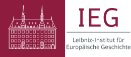
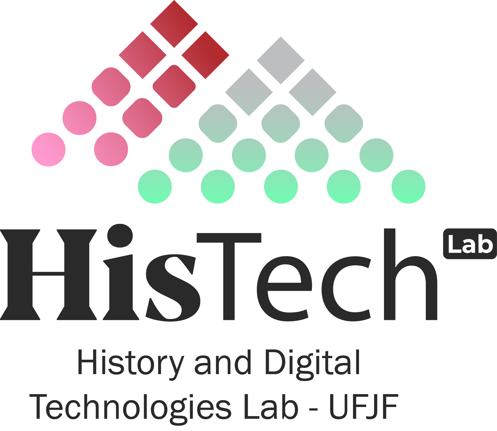

# The Workshop

The [Leibniz Institute of European History (IEG)](https://www.ieg-mainz.de/en/), along with members of the research consortium “[LivArch - Documenting Russia's war against Ukraine: The challenges of living archives for historical knowledge production](https://www.ieg-mainz.de/en/research/research-projects/livarch-die-dokumentation-von-russlands-krieg-gegen-die-ukraine-die-herausforderungen-von-lebenden-archiven-fuer-die-historische-wissensproduktion/)” are happy to introduce the 2nd IEG LivArch Workshop, which focuses on **Sensitivities, Trauma, and Sociability**.

The full-scale invasion of Ukraine in 2022 has triggered an unprecedented effort to digitally document the war, creating a complex ecosystem of archives that capture everything from battlefield evidence to the profound shifts in everyday life. This reality presents a critical ethical challenge: how to balance the urgent duty to document with the moral imperative to protect those involved from re-traumatization.

The second edition of the IEG LivArch Workshop explores this challenge, weighing the dual responsibility archival projects have: a duty of care for staff, volunteers, and contributors – who may be handling traumatic content without professional training – and a duty to users and future scholarship. In this sense, some of the topics that the workshop discusses include: the role of social media in psychological and informational warfare; mental health of the population under conditions that combine persistent violence and destruction with constant information (and disinformation) consumption; forms of sociability and collaborative work in documenting such traumatic experiences; and the shape of collective memory in contexts that involve the interaction of multiple actors – such as scholars, activists, and digital media algorithms.

Counting with specialists and representatives from leading Ukrainian archival initiatives, the workshop aims to make progress in providing answers on how to build and manage these vital digital repositories in an ethical, responsible, and sensitive way that actively fosters the resilience of all participants – understanding that such archives are not only records of violence but also promising sites of collective encounters and sources for understanding the war’s impact on everyday life and mentalities.

**If you are interested in participating in this online workshop, please send a message to the following address: <a href="mailto:digital@ieg-mainz.de">digital@ieg-mainz.de</a>**

# Program
<!-- ([Download as pdf](Insert link)) -->

### 10:00 – Onboarding
#### Speakers:  
*Thorsten Wübbena* ([IEG](https://www.ieg-mainz.de/en/person/wuebbena/)) - Welcoming words  
*Olesia Zvezdova* ([IEG](https://www.ieg-mainz.de/fellow/dr-olesia-zvezdova/)) - The workshop (Concept and schedule)  
  
### 10:20-12:00 - Session 1: Sensitivities in the archive
**Summary:** This session explores how sensitive topics permeate the collections of archives created in the context of the war in Ukraine. The session not only looks at records that express forms of fear, uncertainty, grief, and trauma, but also sheds light on the very act of archiving as a way of dealing with such sensitivities in potentially healing and participatory ways. Speakers will explore:  
  ·	Aspects of the documentation initiatives they have been leading  
  ·	Their experience dealing with sensitive topics regarding traumatic events  
  ·	Traces of subjectivity present within their collections  

#### Speakers:    
*Svitlana Osipchuk* ([War Childhood Museum](https://warchildhood.org/)  
*Bohdan Shumylovych* ([Diaries and Dreams of the War](https://www.lvivcenter.org/en/researches/diaries-and-dreams-of-the-war-2/))  

#### Moderator:  
*Ian Marino* ([UFJF](https://www2.ufjf.br/ppghistoria-en/ian-kisil-marino/) | [IEG](https://www.ieg-mainz.de/en/person/marino/))  

### 12:00-13:15 – Lunch break

### 13:15-14:45 – Session 2: Methods of Counteracting Disinformation in the Context of War
**Summary:** Counteracting disinformation during wartime requires a comprehensive and multilayered approach. Key methods include the creation of transparent communication channels, timely dissemination of verified information, and cooperation between government institutions, media, and civil society.  
  ·	The role of social media in psychological and informational warfare  
  ·	The mental health of the population under conditions of constant information consumption  
  ·	An information campaign of NGOs aimed at documenting the war crimes and countering fakes: participation of the population  
#### Speakers:  
*Olesia Zvezdova* ([IEG](https://www.ieg-mainz.de/fellow/dr-olesia-zvezdova/))
*Natalia Schevchenko* ([National University of Life and Environmental Sciences of Ukraine](https://nubip.edu.ua/en/node/164653), NGO Progresylni)  
*Baruch Schomron* ([Johannes Gutenberg University, Mainz](https://www.zis.uni-mainz.de/gaeste/fellows/baruch-shomron/))  

#### Moderator:  
*Thorsten Wübbena* ([IEG](https://www.ieg-mainz.de/en/person/wuebbena/))

### 14:45-15:00 – Coffee break

### 15:00-16:30 – Session 3: Documenting Destruction and Resilience: Ethical War Archiving and Collective Memory in Ukraine
**Summary:** The full-scale invasion of Ukraine has generated extensive efforts to digitally document the war, capturing both large-scale destruction and everyday human experiences. This workshop examines how such documentation can be preserved responsibly while supporting the resilience of those who create, curate, and contribute to these records.
Bringing together specialists from Ukrainian documentation initiatives, the workshop will focus on:  
· Collective experiences of war and community resilience: documenting trauma, everyday life, oral histories, and the impact of war on academic and cultural communities;  
· Urban destruction and digital documentation: mapping damage to cities and infrastructure, and understanding how such records shape collective memory and urban resilience;  
· Legal and reconstruction perspectives: the role of digital archives in post-war justice, damage assessment, and evidence-based rebuilding, including digital modeling and computational methods.  

#### Speakers:  
*Kristina Trykhlib* (Jagiellonian University, Yaroslav Mudryi National Law University in Kharkiv)  
*Kostiantyn Fedorenko*  
*Anatolii Iashchenko* (Sapienza University of Rome)  

#### Moderator:  
*Iuliia Iashchenko* ([IEG](https://www.ieg-mainz.de/fellow/dr-iuliia-iashchenko/))

### 16:30-17:00 – Closing thoughts
#### Speaker:  
*Ian Marino* ([UFJF](https://www2.ufjf.br/ppghistoria-en/ian-kisil-marino/) | [IEG](https://www.ieg-mainz.de/en/person/marino/))  

---

## Concept and workshop organisation (in alphabetical order)

**Iuliia Iashchenko** [IEG](https://www.ieg-mainz.de/fellow/dr-iuliia-iashchenko/)  
**Ian Marino** [Federal University of Juiz de Fora](https://www2.ufjf.br/ppghistoria-en/ian-kisil-marino/) | [IEG](https://www.ieg-mainz.de/en/person/marino/)  
**Thorsten Wübbena** [IEG](https://www.ieg-mainz.de/en/person/wuebbena/)  
**Olesia Zvezdova** [IEG](https://www.ieg-mainz.de/fellow/dr-olesia-zvezdova/)  

## Contact

### <a href="mailto:digital@ieg-mainz.de">digital@ieg-mainz.de</a>
---

  <!-- IEG Logo -->
  

  

  

    In cooperation with
    
  

